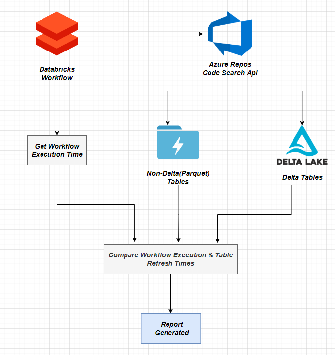

# Introduction

The driver dependency check utility returns all the dependent tables in a workflow and all those tables which need to be moved in the priority queue as their refresh time is after the workflow execution time

#  Design and Implementation

The implementation of the driver check dependency follows the following steps:

1. Gets hold of all the notebooks in the provided databricks workflow

2. Finds the average execution time of all the workflow runs to find the workflow execution time if the avg parameter is set to True otherwise gets the latest execution time of the workflow.
If the workflow has no runs then the utility demands for a place holder time (expected run time of the workflow) as an argument

3. Gets hold of all the tables used in all the notebooks in the workflow

4. Classifies the tables as either Parquet(Non delta) or Delta tables

5. Find the refresh times for both Parquet and Delta tables. For Parquet tables Adls Apis are used while for the Delta tables, Delta Apis are leveraged

6. Comparison is made between the refresh times of tables and the workflow execution time

7. Report is generated which has the following columns : `Table` , `RefreshTime`, `WorkflowName`, `WorkflowExecutionTime`, `ChangeStatus` where `ChangeStatus` has two states - *Requires Change* and *No Change* where *No Change* signifies that the table was refreshed before the execution of the workflow therefore its orchestration should not be changed while *Requires Change* signifies that the table was refreshed after the execution of the workflow therefore its orchestration should be changed

The architecture diagram below further explains the working of the utility in detail

  

